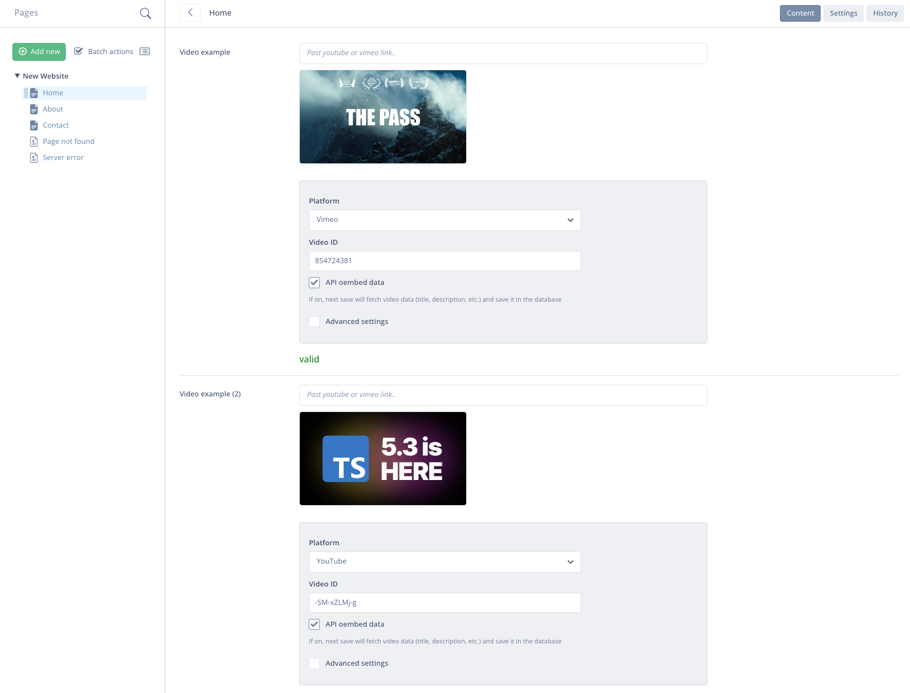
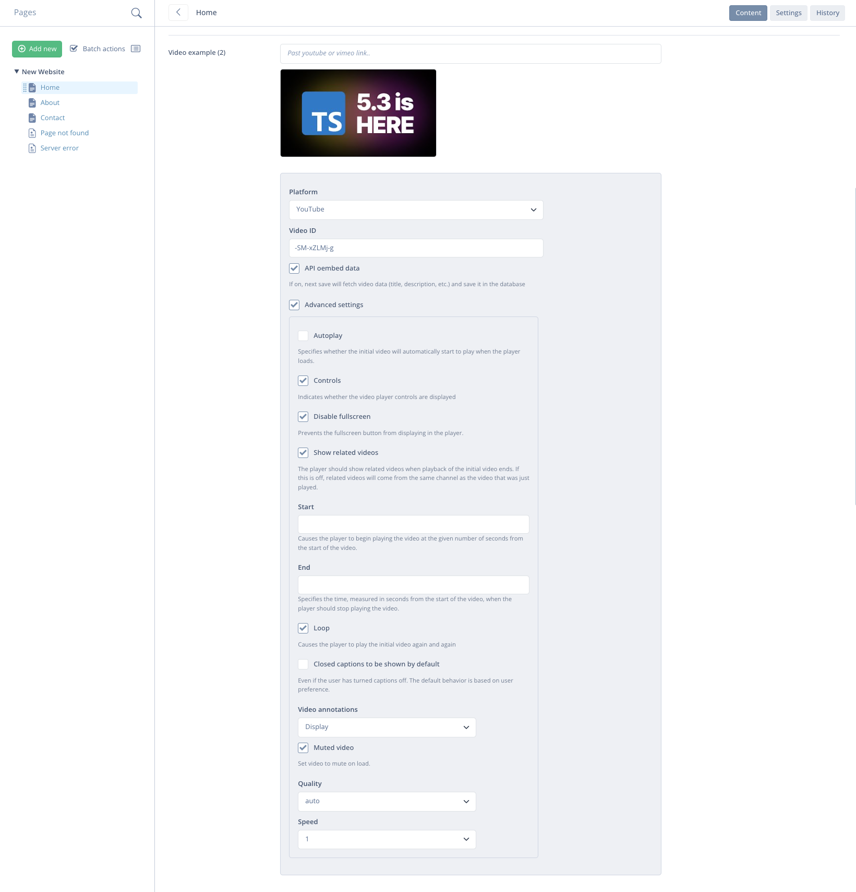

# 🦅 Video Field for Silverstripe

[](https://packagist.org/packages/goldfinch/video-field)
[](https://packagist.org/packages/goldfinch/video-field)
[](https://packagist.org/packages/goldfinch/video-field)
[](https://packagist.org/packages/goldfinch/video-field) 

YouTube & Vimeo video field for Silverstripe. Store video data for further manipulation. Enchant links with parameters through friendly interface, display thumbnails, fetching video data like title, description and more with no extra actions.

## Install

```bash
composer require goldfinch/video-field
```

## Usage

```php
use Goldfinch\VideoField\Forms\VideoField;

private static $db = [
    'Video' => 'Video',
];

// ..

VideoField::create($this, 'Video')

```

```html
<!-- template.ss -->

<!-- General -->
$Video.url
$Video.embedUrl
$Video.plainUrl
$Video.plainEmbedUrl
$Video.iframe
$Video.iframe(300,200)
$Video.thumbnailUrl
$Video.thumbnailUrl(standard)
$Video.thumbnail
$Video.thumbnail(standard)
<%-- $Video.dumpAllThumbnails --%>

<!-- Youtube (API oembed data) -->
$Video.hostData.title
$Video.hostData.author_name
$Video.hostData.author_url
$Video.hostData.type
$Video.hostData.height
$Video.hostData.width
$Video.hostData.version
$Video.hostData.provider_name
$Video.hostData.provider_url
$Video.hostData.thumbnail_height
$Video.hostData.thumbnail_width
$Video.hostData.thumbnail_url
$Video.hostData.html

<!-- Vimeo (API oembed data) -->
$Video.hostData.type
$Video.hostData.version
$Video.hostData.provider_name
$Video.hostData.provider_url
$Video.hostData.title
$Video.hostData.author_name
$Video.hostData.author_url
$Video.hostData.is_plus
$Video.hostData.account_type
$Video.hostData.html
$Video.hostData.width
$Video.hostData.height
$Video.hostData.duration
$Video.hostData.description
$Video.hostData.thumbnail_url
$Video.hostData.thumbnail_width
$Video.hostData.thumbnail_height
$Video.hostData.thumbnail_url_with_play_button
$Video.hostData.upload_date
$Video.hostData.video_id
$Video.hostData.uri
```

## Previews

#### Video fields

#### Video settings


## License

The MIT License (MIT)
